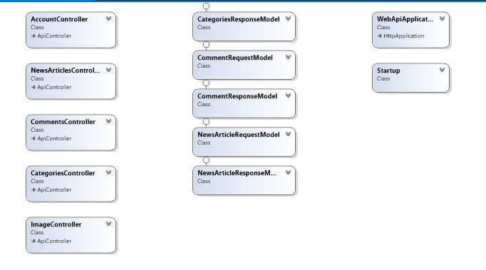
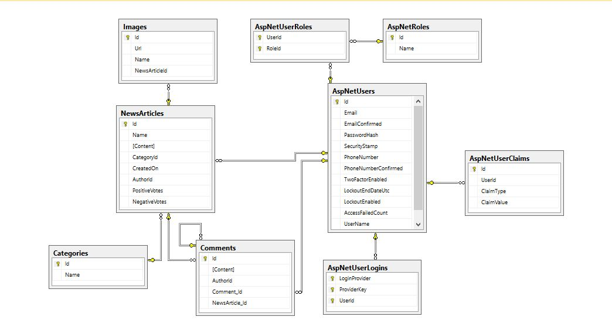

#Team "Heracles"

A team project for Telerik Software Academy 2015's Web Services and Cloud course.

###Team members:
*	Теодор Чолаков
*	Иван Василев
*	Константин Адаму
*	Огнян Алексиев
*	Любомир Йончев

###Project:
CrowdSourcedNews with web client

###Class Diagram:

###DbDiagram:

### Project Description

A web application for posting News Articles, where one can:

*	publish a news article containing images 
*	add comment under news articles
*	comments can be nested
*	vote for and against news articles 
*	receive notifications when a new news article is published

News Articles are stored in different categories.

###The URL of source control repository is:
https://github.com/Moiraines/WebNews

###Service url in Azure:
http://crowdsourcednews.azurewebsites.net/

### Additional Notes

*	Server-side: ASP.Net Web API
*	Client-side: HTML, CSS, JavaScript (additional libraries and frameworks: Angular, jQuery, Bootstrap, Toastr)

